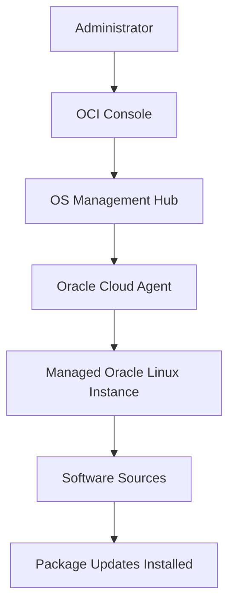

# OCI-OS-Management-Hub-Guide

## Overview

The repository explains how OS Management Hub is used to manage operating system updates, software sources, patch scheduling, package updates, and managed Oracle Linux instances from OCI.
My focus was to explain the basic flow clearly: the administrator works from the OCI Console, OS Management Hub coordinates the patch operation, Oracle Cloud Agent runs the update on the instance, and software sources provide the required packages.
This contribution demonstrates my understanding of how OS Management Hub helps manage operating system patching and package lifecycle for OCI compute instances. No client-confidential, proprietary, or project-specific information is included.

---

## Why I Created This

Operating system patching is an important part of cloud operations.
Without a controlled patching process, compute instances can become outdated or inconsistent. OS Management Hub helps centralize this process so administrators can review updates, attach software sources, schedule patch operations, and manage updates across instances.
I created this repository to explain that product flow in a simple way.

---

## Product Used

Oracle Cloud Infrastructure OS Management Hub

---

## Simple OS Management Hub Flow

---

## Components Covered

This repository covers the following components:

- OS Management Hub
- Oracle Cloud Agent
- Managed Instances
- Software Sources
- Instance Groups
- Patch Management
- Patch Scheduling
- Package Exclusion
- Update monitoring

---

## What I Understood

The key point from this exercise is that patching should not be treated as only running an update command on a server.
A proper patching process needs visibility, control, timing, and consistency. OS Management Hub helps with this by connecting the OCI Console, managed instances, Oracle Cloud Agent, software sources, and patch schedules into one controlled process.
This helped me understand how OCI supports operating system maintenance from a central management point.

---

## Confidentiality Note

All examples in this repository are based on my own product usage and documentation. No client-confidential, proprietary, or project-specific information is included.
