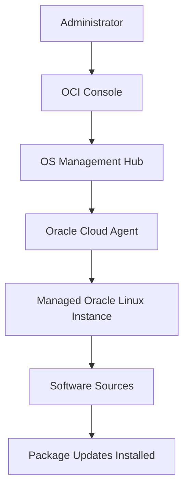

# OS Management Hub Flow

This diagram shows a simple OS Management Hub flow in Oracle Cloud Infrastructure.

The main point is that patching is managed centrally from OCI. OS Management Hub coordinates the operation, Oracle Cloud Agent runs the update on the instance, and software sources provide the required packages.
