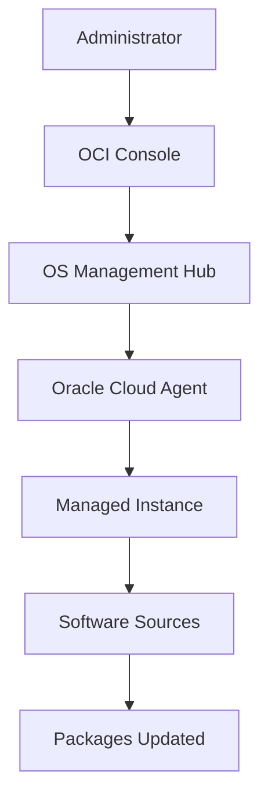

# Patch Management Workflow

## Overview

Patch management is used to keep operating systems updated and secure.
In Oracle Cloud Infrastructure, OS Management Hub provides a central place to manage updates for Oracle Linux compute instances.
This document explains the basic patch management flow using OS Management Hub.

---

## Patch Management Flow



---

## Step 1 - Managed Instance Registration

Before patching can be managed, the compute instance must be available as a managed instance in OS Management Hub.

The Oracle Cloud Agent is used to communicate between the compute instance and OCI.

The OS Management Hub plugin should be enabled so the instance can be managed for update operations.

---

## Step 2 - Software Source Configuration

Software sources provide the packages and updates required by the operating system.

A managed instance needs the correct software sources attached before updates can be reviewed or applied.

Examples of software sources include operating system repositories and security update repositories.

---

## Step 3 - Review Available Updates

After the instance is registered and software sources are configured, administrators can review available updates from OS Management Hub.

This helps identify which instances require package updates or security patches.

---

## Step 4 - Run Patch Operation

Patch updates can be initiated from the OCI Console using OS Management Hub.

The update request is sent to the Oracle Cloud Agent on the compute instance. The agent then runs the required package update operation on the instance.

Example command used on an Oracle Linux instance:

```bash
sudo dnf update
```

---

## Step 5 - Monitor Update Status

After the patch operation is started, the administrator can monitor the status from OS Management Hub.

This provides visibility into whether the update completed successfully or needs review.

---

## What I Understood

My main understanding is that patch management in OCI is not only about updating one server.

OS Management Hub helps centralize the update process so administrators can review updates, manage software sources, run patch operations, and monitor status across managed instances.
