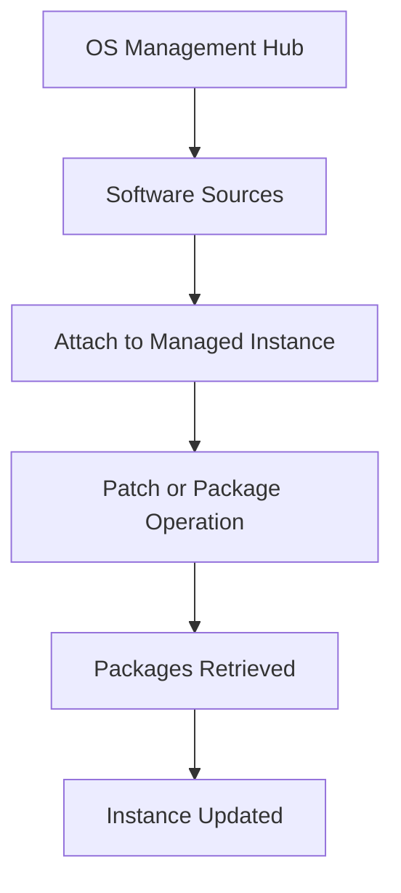

# Repository Configuration

## Overview

Software sources provide the packages required to install, update, and maintain Oracle Linux instances.
In OS Management Hub, software sources are used to control which repositories are available to managed instances.
This document explains the basic repository configuration flow.

---

## What Are Software Sources?

Software sources are repositories that contain operating system packages and updates.
They are used during package installation and patch update operations.

Examples include:

- Oracle Linux BaseOS
- Oracle Linux AppStream
- Security update repositories
- Custom software sources, where applicable

---

## Why Repository Configuration Matters

Repository configuration is important because managed instances should use approved and consistent package sources.
If repositories are not controlled properly, instances may receive inconsistent package versions or unapproved packages.
Centralized software source management helps keep the update process more controlled.

---

## Repository Configuration Flow



---

## Step 1 - Open Software Sources

From the OCI Console, administrators can navigate to OS Management Hub and review available software sources.
This helps confirm which repositories are available for use.

---

## Step 2 - Attach Software Sources

A software source must be attached to the managed instance or group before package updates can be applied.
This ensures that the instance receives packages from the intended source.

---

## Step 3 - Use During Updates

During a patch operation, the managed instance retrieves packages from the attached software sources.
Example package update command on Oracle Linux:

```bash
sudo dnf update
```

---

## What I Understood

My main understanding is that software sources are a key part of patch control.
The patch process depends not only on the instance, but also on which repositories are attached and approved for package updates.
