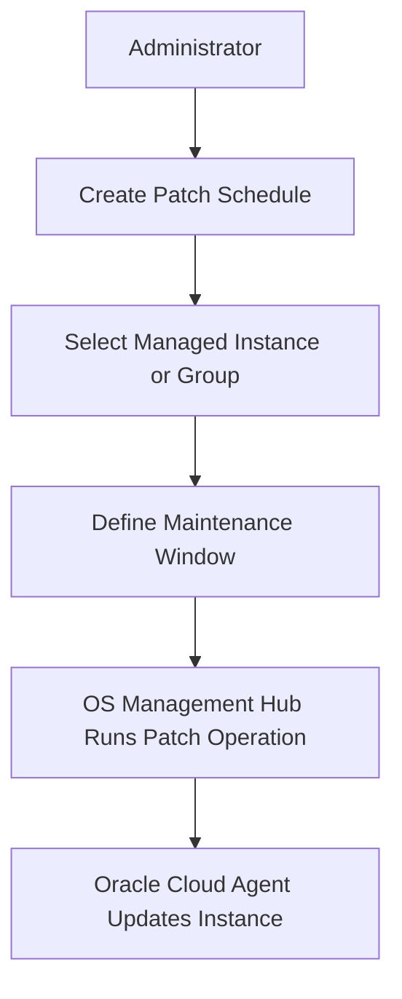

# Patch Scheduling and Package Exclusion

## Overview

OS Management Hub supports controlled patching by allowing administrators to schedule patch operations and manage package exclusions.
These capabilities are useful when updates need to be applied during planned maintenance windows or when specific packages should not be updated.

---

## Patch Scheduling

Patch scheduling allows administrators to plan when updates should run.
This is useful for reducing operational impact and keeping updates aligned with maintenance windows.

Examples of patch schedules:

- Weekly security patching
- Monthly maintenance patching
- Separate schedules for development and production environments

---

## Patch Scheduling Flow

---

## Package Exclusion

Package exclusion is used when a package should not be updated during a patch operation.
This can be useful when an application depends on a specific package version.
Package exclusion helps avoid unintended changes during patching.

---

## Example

A production application may depend on a specific package version.
In that case, the package can be excluded from the patch operation until the team confirms that the newer version is safe to apply.

---

## What I Understood

My main understanding is that patching should be controlled and planned.
Scheduling helps control when patching happens. Package exclusion helps control what gets updated. Both are important when managing systems that support running applications.
